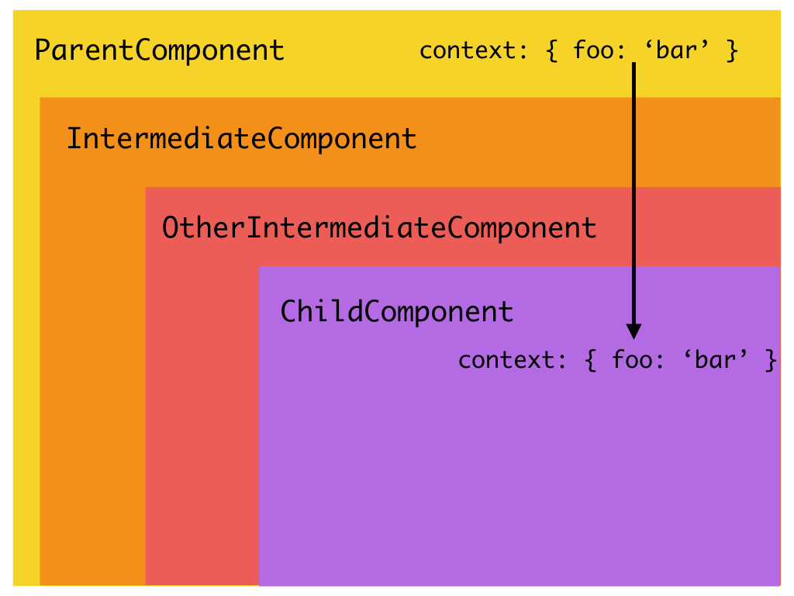

# Context API

## Usage
Les `props` servent à faire passer des données dans la hiérarchie des composants.
Toutefois, lorsque la profondeur de cette dernière est importante, cela oblige chaque composant à littéralement transférer les valeurs, jusqu'à plusieurs niveaux. Cette méthodologie bien que fonctionnelle provoque assez vite du code verbeux.

L'API `Context` quant à elle permet de faire passer des valeurs, quelque soit la hiérarchie d'imbrication des composants. En effet, deux éléments rentrent en jeu dans cette communication à travers les niveaux : 
- un `Provider`
- un `Consumer` 



## Implémentation

### Création du contexte

```js
// src/HeticContext.js
import React from 'react';
export default React.createContext( [] );
```

La valeur passée à la création du contexte définit la valeur par défaut.

### Le composant `Provider`

```js
// src/Students.js
import React from 'react';
import HeticContext from './HeticContext';
export default () => (
  <HeticContext.Provider value={[{ name:'Priou' }, { name:'Masselot' }]}>
    <ListContainer />
  </HeticContext.Provider>
);
```

### Le composant `Consumer`

Quelque soit le niveau d'imbrication dans le composant `Students`, un composant peut accéder à un `Consumer` :

```js
// src/StudentList.js
import React from 'react';
import HeticContext from './HeticContext';
export default () => (
    <ul>
      <HeticContext.Consumer>
      {
          value => 
          (
              value.map( s => <li> s.name </li> )
          )
      }
      </HeticContext.Consumer>
    </ul>
);
```

[Exemple d'implémentation](https://github.com/heticeric/react_context-demo)
